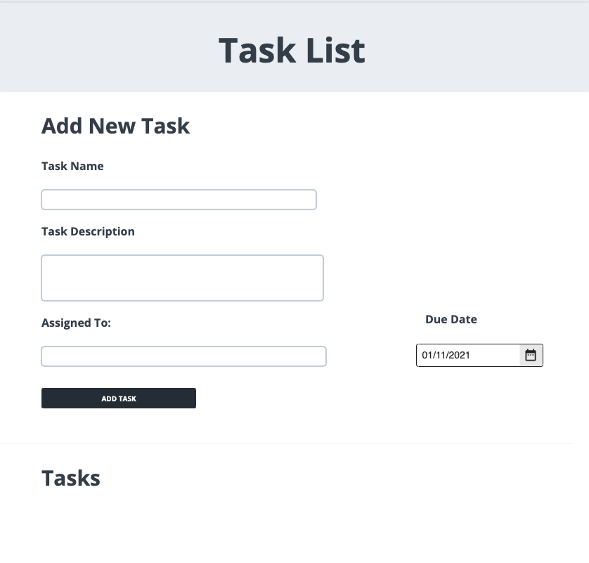
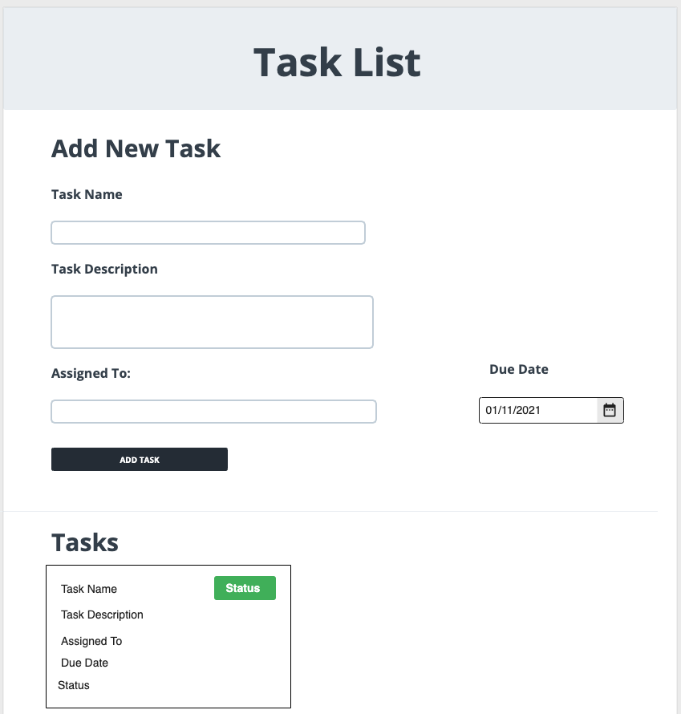

# Task 1: Design your App Wireframes

## Description

Is always a good practice to design first before start coding. The objective of this task is to create the Task planner app wireframes to understand how it will work and look.

## Walkthrough

### Step 1: 
Create an account on <a href="https://moqups.com/" target="_blank">Moqups</a>

### Step 2: Create your App Wireframe

In this step, we'll create the wireframes of your `TaskManager` application. Make sure you read the acceptance criteria on the **results** section before
you start designing. Ask the instructor if you have any questions!

> #### Useful Resources for this step
> - <a href="https://webdesign.tutsplus.com/articles/a-beginners-guide-to-wireframing--webdesign-7399" target="_blank">beginners guide to wireframing</a>

> #### Test your Design!
> Navigate through your designs and validate that you meet the **assesment criteria**. 

> **Expected Result**
> You should be able to navigate to all screens and fulfill the requirements.

## Results

You should have implemented the different screens of your application (possibly a one page application).

Your task should meet the assesment criteria in the **Final Project - Scorecard Rubric**.

## Example 1:
 

## Example 2: Moqup layout w/ task card added 

